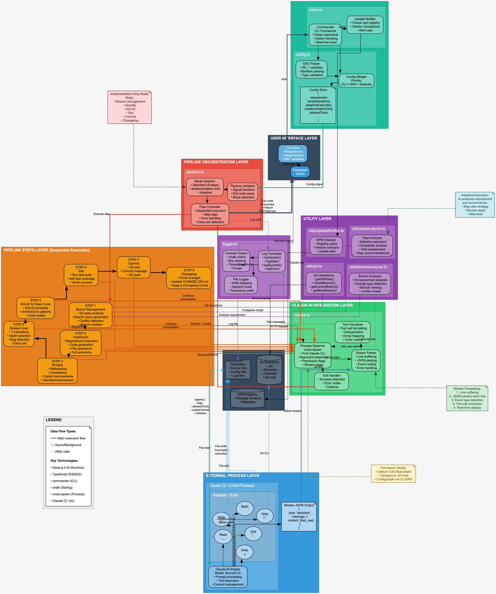

# software-engineer

A CLI tool that automates the software development workflow using Claude AI. It runs an 8-step pipeline to implement features, simplify code, review, ensure quality, test, commit, and update changelogs with real-time progress visualization.

By default, Claude is automatically granted permission to **Edit, Read, and Bash** tools, allowing seamless autonomous operation without constant permission prompts.


## The Brain



## Installation

```bash
npm install -g software-engineer
```

## Prerequisites

- Node.js >= 18.0.0
- [Claude CLI](https://github.com/anthropics/claude-code) installed and configured

## Recommended Workflow

For best results, follow this workflow:

1. **Plan with Claude**: Start a Claude session and use plan mode to design what needs to be done
   - Discuss requirements with Claude
   - Iterate and refine the plan until it's complete
   - Claude will generate a plan file (usually a `.md` file)

2. **Execute with software-engineer**: Once your plan is finalized, close Claude and run:
   ```bash
   sf "implement the plan mentioned in /path/to/plan.md"
   ```

3. **Wait for completion**: The tool will automatically execute the entire pipeline and implement your plan

This approach gives you the best of both worlds:
- **Interactive planning** with Claude to ensure the approach is correct
- **Automated execution** with comprehensive quality checks
- **Seamless operation** - Claude automatically has permission to edit files, read code, and run commands without prompts

## Usage

```bash
sf "<requirement>"
```

### Examples

```bash
# Recommended: Use with a plan file from Claude
sf "implement the plan mentioned in ./docs/feature-plan.md"

# Basic usage with direct requirement
sf "add user authentication with JWT"

# Custom review iterations
sf --reviews 3 "refactor database layer"

# Dry run to preview commands
sf --dry-run "add dark mode toggle"

# Skip tests and push
sf --skip-tests --skip-push "update README"

# Log output to file
sf --log pipeline.log "implement caching layer"
```

## Permission Management

By default, `software-engineer` automatically grants Claude permission to use **Edit, Read, and Bash** tools without prompting. This streamlines the workflow while maintaining control over file operations.

### Default Behavior

When you run the tool, it automatically passes `--allowedTools "Edit,Read,Bash"` to Claude:
- **Edit**: Modify existing files
- **Read**: Read file contents
- **Bash**: Execute shell commands (git, npm, build tools, etc.)

This means Claude can work autonomously on your codebase without constant permission prompts, making the pipeline smooth and efficient.

### Customizing Allowed Tools

You can customize which tools are auto-approved:

```bash
# Allow additional tools
sf --allowedTools "Edit,Read,Write,Bash,Grep" "add new feature"

# Via environment variable
SF_ALLOWED_TOOLS="Edit,Read,Write,Bash" sf "implement caching"

# Restrict to read-only operations
sf --allowedTools "Read,Grep,Glob" "analyze the codebase"
```

### Skipping All Permissions (Use with Caution)

For fully autonomous operation in trusted environments (like CI/CD), you can skip all permission checks:

```bash
sf --dangerously-skip-permissions "implement feature"
```

**Warning**: This bypasses ALL permission prompts. Only use in isolated, secure environments.

**Note**: When `--dangerously-skip-permissions` is used, the `allowedTools` setting is ignored.

## Options

| Option | Description |
|--------|-------------|
| `-d, --dry-run` | Print commands without executing |
| `-r, --reviews <n>` | Number of review iterations (default: 2) |
| `-a, --adaptive` | Enable adaptive step execution (AI decides which steps to skip) |
| `--skip-tests` | Skip the testing step |
| `--skip-push` | Commit but don't push to remote |
| `--skip-branch-management` | Skip smart branch management |
| `--log <file>` | Log output to file |
| `--allowedTools <tools>` | Comma-separated list of allowed tools (default: "Edit,Read,Bash") |
| `--dangerously-skip-permissions` | Skip Claude permission prompts (overrides allowedTools) |
| `-h, --help` | Display help |
| `-V, --version` | Display version |

## Environment Variables

All options can be set via environment variables:

| Variable | Description |
|----------|-------------|
| `SF_REVIEW_ITERATIONS` | Number of review iterations |
| `SF_ADAPTIVE_EXECUTION` | `true`/`false` for adaptive execution |
| `SF_DRY_RUN` | `true`/`false` for dry run |
| `SF_LOG_FILE` | Path to log file |
| `SF_SKIP_TESTS` | `true`/`false` to skip tests |
| `SF_SKIP_PUSH` | `true`/`false` to skip push |
| `SF_SKIP_BRANCH_MANAGEMENT` | `true`/`false` to skip branch management |
| `SF_ALLOWED_TOOLS` | Comma-separated list of allowed tools (default: "Edit,Read,Bash") |
| `SF_DANGEROUSLY_SKIP_PERMISSIONS` | `true`/`false` to skip Claude permissions (overrides allowedTools) |

Example:
```bash
SF_REVIEW_ITERATIONS=3 sf "add feature X"
```

## Features

- **Automatic Permission Management**: Claude is pre-authorized to Edit, Read, and execute Bash commands by default - no constant permission prompts
- **Real-time Progress Visualization**: See exactly what Claude is doing with colorized, emoji-enhanced output
  - 📖 File reads in cyan
  - ✍️ File writes in green
  - ✏️ File edits in yellow
  - ⚡ Command execution in magenta
  - 🔍 Code searches in blue
- **Smart Branch Management**: Automatically creates feature branches based on requirement type
- **Adaptive Execution**: AI-powered step optimization that skips unnecessary stages
- **Comprehensive Code Quality**: Multi-stage review process ensuring best practices

## Pipeline Steps

### 1. Smart Branch Management
Analyzes your requirement and automatically creates appropriate feature branches:
- Detects change type (feature/fix/refactor/docs/chore)
- Creates semantically named branches
- Warns about potential conflicts

### 2. Implement
Claude understands your codebase and implements the requirement:
- Analyzes project structure and patterns
- Follows project conventions
- Handles edge cases appropriately
- Minimal, focused changes

### 3. Code Simplification
Refines the implementation for clarity, consistency, and maintainability:
- Follows project standards (ES modules, explicit types)
- Enhances clarity by avoiding nested ternaries
- Removes redundant abstractions

### 4. Code Review (configurable iterations)
Reviews the implementation for:
- Bugs (logic errors, null refs, race conditions)
- Security issues (injection, auth problems)
- Performance (N+1 queries, memory leaks)
- Maintainability (clarity, naming, complexity)

### 5. SOLID & Clean Code
Ensures compliance with:
- SOLID principles (SRP, OCP, LSP, ISP, DIP)
- Clean code practices (naming, small functions, no magic numbers)

### 6. Testing
- Runs existing tests
- Adds new tests for changed code
- Verifies coverage

### 7. Commit
Creates a well-formatted commit with:
- Conventional commit format
- Clear subject line
- Detailed body explaining why and what

### 8. Changelog
Updates CHANGELOG.md following Keep a Changelog format.

## License

MIT
