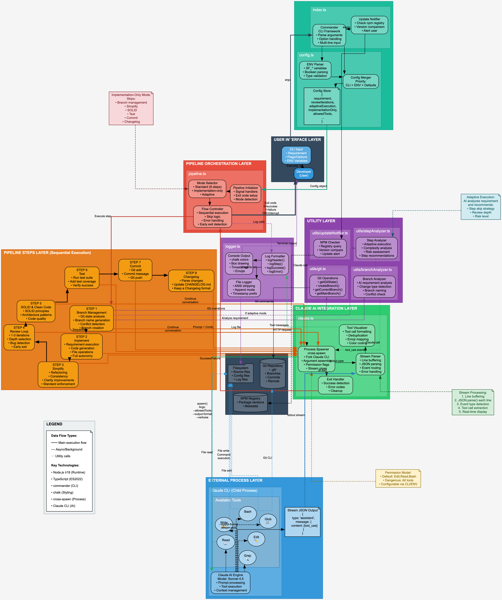

# software-engineer

A CLI tool that automates the software development workflow using Codex by default, with Claude available via `--agent claude`. It runs an 8-step pipeline to implement features, simplify code, review, ensure quality, test, commit, and update changelogs.


## The Brain



## Installation

```bash
npm install -g software-engineer
```

## Prerequisites

- Node.js >= 18.0.0
- [Codex CLI](https://developers.openai.com/codex/cli/) installed and configured
- Optional: [Claude CLI](https://github.com/anthropics/claude-code) installed and configured for `--agent claude`

## Recommended Workflow

For best results, follow this workflow:

1. **Plan with Claude**: Start a Claude session and use plan mode to design what needs to be done
   - Discuss requirements with Claude
   - Iterate and refine the plan until it's complete
   - Claude will generate a plan file (usually a `.md` file)

2. **Execute with software-engineer**: Once your plan is finalized, run:
   ```bash
   sf "implement the plan mentioned in /path/to/plan.md"
   ```

3. **Wait for completion**: The tool will automatically execute the entire pipeline and implement your plan

This approach gives you the best of both worlds:
- **Interactive planning** with Claude to ensure the approach is correct
- **Automated execution** with comprehensive quality checks
- **Seamless operation** - Codex runs non-interactively with workspace-write sandboxing by default

## Usage

```bash
sf "<requirement>"
```

### Examples

```bash
# Recommended: Use with a plan file
sf "implement the plan mentioned in ./docs/feature-plan.md"

# Basic usage with direct requirement
sf "add user authentication with JWT"

# Custom review iterations
sf --reviews 3 "refactor database layer"

# Dry run to preview commands
sf --dry-run "add dark mode toggle"

# Use Claude instead of Codex
sf --agent claude "add dark mode toggle"

# Skip tests and push
sf --skip-tests --skip-push "update README"

# Log output to file
sf --log pipeline.log "implement caching layer"
```

## Agent And Permission Management

By default, `software-engineer` runs Codex:

```bash
codex exec --sandbox workspace-write --ask-for-approval never "<prompt>"
```

Claude remains available:

```bash
sf --agent claude "implement feature"
SF_AGENT=claude sf "implement feature"
```

### Claude Allowed Tools

`--allowedTools` and `SF_ALLOWED_TOOLS` apply only to Claude. Codex uses sandbox and approval flags instead.

```bash
# Allow additional tools
sf --agent claude --allowedTools "Edit,Read,Write,Bash,Grep" "add new feature"

# Via environment variable
SF_AGENT=claude SF_ALLOWED_TOOLS="Edit,Read,Write,Bash" sf "implement caching"

# Restrict to read-only operations
sf --agent claude --allowedTools "Read,Grep,Glob" "analyze the codebase"
```

### Skipping Sandboxes And Permissions (Use with Caution)

For fully autonomous operation in trusted environments (like CI/CD), you can skip all permission checks:

```bash
sf --dangerously-skip-permissions "implement feature"
```

For Codex this maps to `codex exec --dangerously-bypass-approvals-and-sandbox`. For Claude this maps to `claude --dangerously-skip-permissions`.

**Warning**: This bypasses permission prompts and/or sandboxing. Only use in isolated, secure environments.

## Run Individual Stages

You can run specific pipeline stages directly without executing the full pipeline. This is useful for running a quick review or cleanup on code you've already written.

```bash
# Run only the code simplification step
sf --simplify

# Run only the code review step
sf --review

# Run only the SOLID & clean code check
sf --clean-code

# Run only the testing step
sf --test

# Run only the commit step
sf --commit

# Run only the implementation step (requires a requirement)
sf --implement "add error handling to the API"

# Combine multiple stages (executed in pipeline order)
sf --simplify --review --clean-code

# Works with other options
sf --review -r 3         # 3 review iterations
sf --review --dry-run    # Preview without executing
```

**Note**: All stages except `--implement` work without a requirement — they operate on the current state of your code. You can combine multiple stage flags and they will run in pipeline order.

## Options

| Option | Description |
|--------|-------------|
| `-d, --dry-run` | Print commands without executing |
| `-r, --reviews <n>` | Number of review iterations (default: 2) |
| `-a, --adaptive` | Enable adaptive step execution (AI decides which steps to skip) |
| `--skip-tests` | Skip the testing step |
| `--skip-push` | Commit but don't push to remote |
| `--skip-branch-management` | Skip smart branch management |
| `--implementation-only` | Run only: Implement → Review → SOLID |
| `--implement` | Run only the implementation step |
| `--simplify` | Run only the code simplification step |
| `--review` | Run only the code review step |
| `--clean-code` | Run only the SOLID & clean code step |
| `--test` | Run only the testing step |
| `--commit` | Run only the commit step |
| `--changelog` | Run only the changelog step |
| `--log <file>` | Log output to file |
| `--agent <agent>` | Agent to run: `codex` or `claude` (default: `codex`) |
| `--allowedTools <tools>` | Claude-only comma-separated list of allowed tools (default: "Edit,Read,Bash") |
| `--dangerously-skip-permissions` | Bypass agent permission prompts/sandboxing |
| `-h, --help` | Display help |
| `-V, --version` | Display version |

## Environment Variables

All options can be set via environment variables:

| Variable | Description |
|----------|-------------|
| `SF_REVIEW_ITERATIONS` | Number of review iterations |
| `SF_ADAPTIVE_EXECUTION` | `true`/`false` for adaptive execution |
| `SF_DRY_RUN` | `true`/`false` for dry run |
| `SF_LOG_FILE` | Path to log file |
| `SF_SKIP_TESTS` | `true`/`false` to skip tests |
| `SF_SKIP_PUSH` | `true`/`false` to skip push |
| `SF_SKIP_BRANCH_MANAGEMENT` | `true`/`false` to skip branch management |
| `SF_AGENT` | `codex` or `claude` |
| `SF_ALLOWED_TOOLS` | Claude-only comma-separated list of allowed tools (default: "Edit,Read,Bash") |
| `SF_DANGEROUSLY_SKIP_PERMISSIONS` | `true`/`false` to bypass agent permission prompts/sandboxing |

Example:
```bash
SF_REVIEW_ITERATIONS=3 sf "add feature X"
```

## Features

- **Automatic Agent Management**: Codex runs by default; Claude remains available with `--agent claude`
- **Real-time Progress Visualization**: See agent output and Claude tool calls with colorized output
  - 📖 File reads in cyan
  - ✍️ File writes in green
  - ✏️ File edits in yellow
  - ⚡ Command execution in magenta
  - 🔍 Code searches in blue
- **Smart Branch Management**: Automatically creates feature branches based on requirement type
- **Adaptive Execution**: AI-powered step optimization that skips unnecessary stages
- **Comprehensive Code Quality**: Multi-stage review process ensuring best practices

## Pipeline Steps

### 1. Smart Branch Management
Analyzes your requirement and automatically creates appropriate feature branches:
- Detects change type (feature/fix/refactor/docs/chore)
- Creates semantically named branches
- Warns about potential conflicts

### 2. Implement
The selected agent understands your codebase and implements the requirement:
- Analyzes project structure and patterns
- Follows project conventions
- Handles edge cases appropriately
- Minimal, focused changes

### 3. Code Simplification
Refines the implementation for clarity, consistency, and maintainability:
- Follows project standards (ES modules, explicit types)
- Enhances clarity by avoiding nested ternaries
- Removes redundant abstractions

### 4. Code Review (configurable iterations)
Reviews the implementation for:
- Bugs (logic errors, null refs, race conditions)
- Security issues (injection, auth problems)
- Performance (N+1 queries, memory leaks)
- Maintainability (clarity, naming, complexity)

### 5. SOLID & Clean Code
Ensures compliance with:
- SOLID principles (SRP, OCP, LSP, ISP, DIP)
- Clean code practices (naming, small functions, no magic numbers)

### 6. Testing
- Runs existing tests
- Adds new tests for changed code
- Verifies coverage

### 7. Commit
Creates a well-formatted commit with:
- Conventional commit format
- Clear subject line
- Detailed body explaining why and what

### 8. Changelog
Updates CHANGELOG.md following Keep a Changelog format.

## License

MIT
